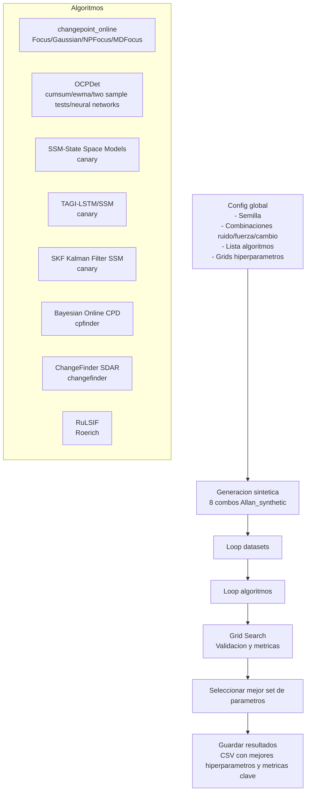

# Main 2 Synthetic Pipeline

## Overview
- Inicializar configuraciones globales (semilla, combinaciones ruido/fuerza/tipo, lista de algoritmos, rejillas de hiperparametros).
- Generar las ocho combinaciones de series sinteticas Allan_synthetic.
- Ejecutar cada algoritmo sobre cada dataset aplicando busqueda en rejilla y evaluacion.
- Registrar metricas clave y los mejores hiperparametros en el CSV final.

